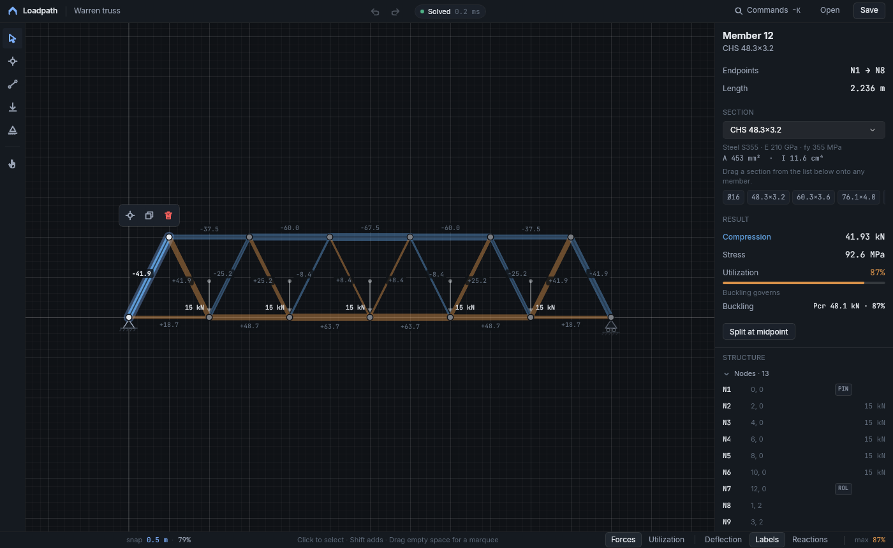
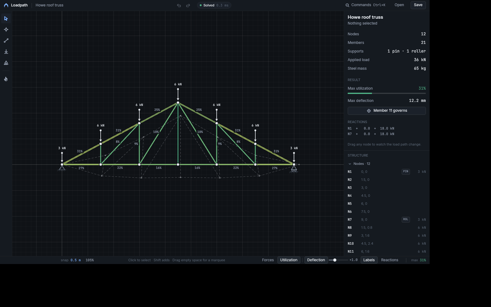
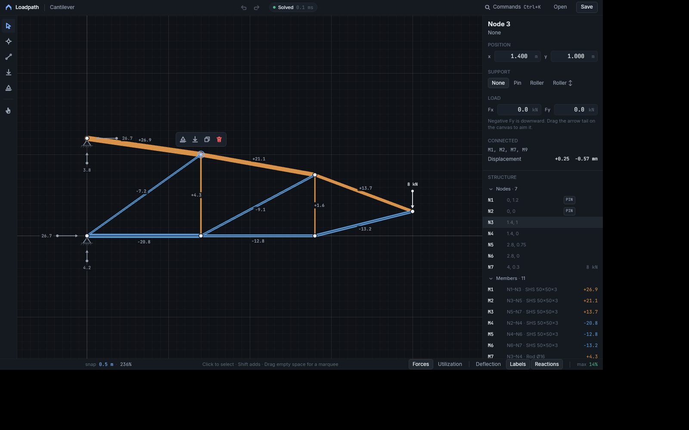
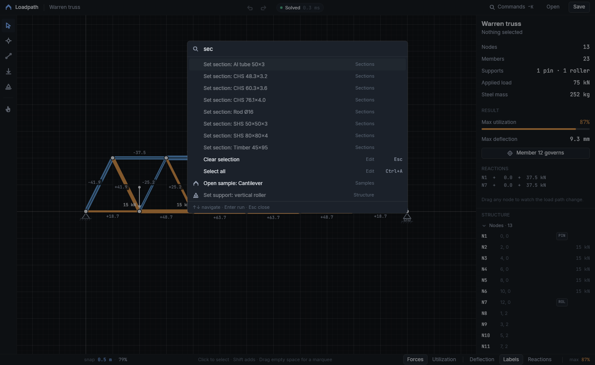
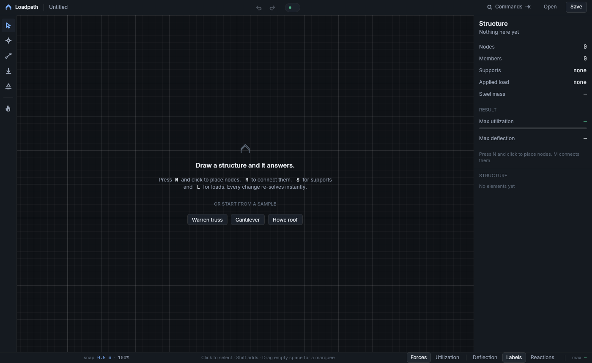

# Loadpath

A desktop workbench for 2D trusses that solves as you draw. Place nodes, connect them, pin some to the ground, hang loads, and every member shows the force it carries, its utilization, and the deflected shape. Drag a node and the whole load path re-solves on every pointer move.

Built with Uno Platform (`Uno.Sdk 6.7.30`, `net10.0-desktop`, Skia renderer). The product and interaction design are in [`SPEC.md`](SPEC.md); this file covers what shipped, how it is built, and how it was validated.



## Run

```powershell
dotnet build Loadpath/Loadpath.csproj -f net10.0-desktop
dotnet run --project Loadpath/Loadpath.csproj -f net10.0-desktop
dotnet test Loadpath.Tests/Loadpath.Tests.csproj
```

In Debug, set `APP_NO_HOTDESIGN=1` to skip `UseStudio()` when no DevServer is reachable (headless runs).

## What it does

| Capability | How it shows up |
|---|---|
| Live analysis | Direct stiffness solve on every edit, sub-millisecond for the samples. Status chip in the title strip, max utilization in the status bar. |
| Force ribbons | Member width scales with axial force; copper is tension, steel-blue is compression, and compression members carry a dark core line so sign is never color-alone. Overstressed members turn red with hatch ticks. |
| Tools | `V` select, `N` node (click a member to split it), `M` member (chains; click empty space to add a node), `L` load (click for 10 kN down, drag from a node to aim), `S` support (cycles pin → roller → none), `H` pan or hold `Space`. |
| Selection | Click, `Shift`-click, marquee (`Alt` selects what touches), `Ctrl+A`. The floating bar above a selection offers support, load, split, duplicate, delete. |
| Manipulation | Drag nodes or members with grid snap, alignment guides, `Shift` axis lock, `Alt` to disable snapping. Arrow keys nudge, `Shift` ×5. Load arrow tails are handles. |
| Inspectors | Summary, node (position, support, load fields), member (section, material, force, stress, utilization bar, buckling check), mixed (bulk actions). Sections drag from the inspector onto members. |
| Outline | Nodes and members with support badges and signed forces; click selects, hover highlights on canvas. |
| Display modes | `1` forces, `2` utilization ramp, `3` deflected ghost with exaggeration slider, `4` labels, `5` reactions. |
| Commands | Every action is an `AppCommand` with one shortcut label. `Ctrl+K` opens a searchable palette; right-click opens element-specific menus. |
| Undo/redo | Every mutation is a reversible edit. Drags coalesce into one entry. `Ctrl+Z`, `Ctrl+Y`. |
| Persistence | `.loadpath` JSON documents (save, save as, open), autosave restored on launch, view options persisted. |
| States | Empty-state invitation with three samples, mechanism banner when the structure can move, a warning when parts are not connected to a support (they are left out of the solve instead of failing it), toasts for refused actions. |









## Architecture

```
Loadpath.Core/      net10.0 class library, no UI dependency
  Model/            StructureDocument, Node, Member, Section, Material
  Analysis/         TrussSolver (direct stiffness), LinearSolver, AnalysisResult
  Editing/          IEdit, EditHistory (undo/redo, coalescing, transactions), edits
  Selection/        SelectionSet
  Viewport/         Viewport (world ↔ screen, zoom-at-point, fit)
  Geometry/         Vec2, Bounds, HitTester, SnapEngine, GridSteps
  Serialization/    DocumentSerializer (JSON v1)
  Samples/          Warren, cantilever, Howe roof
Loadpath/           Uno single-project app
  Presentation/     EditorEngine (imperative), EditorModel (MVUX states, feeds, commands), Records, ViewOptions
  Commands/         AppCommand, CommandRegistry (shortcut parsing)
  Workspace/        WorkspaceView (SKCanvasElement), WorkspaceRenderer, RenderSnapshot, WorkspaceInteraction, Tools/
  Views/            TitleStrip, ToolRail, InspectorPanel, OutlinePanel, StatusBar, CommandPalette
  Controls/         Icon, ToolButton, NumberField, UtilizationBar, KeySink, IconLibrary, Converters
  Services/         FileService, SettingsService
  Themes/           Tokens, MotionTokens, Icons, Controls
Loadpath.Tests/     xunit: solver against method-of-joints values, mechanism detection, history, geometry, serializer
```

**Decision: MVUX for the presentation layer, an imperative engine for the document.** `EditorModel` is a `partial record` whose states and feeds carry immutable records (`EditorStatus`, `InspectorContent`, `OutlineItem`, `PaletteItem`); the generated `EditorViewModel` is the page's DataContext and every view binds with `{Binding}`. Buttons bind generated commands; undo and redo are feed-gated (`Command.Create(b => b.Given(Status).When(s => s.CanUndo)...)`). `EditorEngine` owns the document, undo history, selection, viewport and tools, and raises events the model projects into states, because a solve on every pointer move cannot copy an immutable document per frame. Tradeoff: two layers, and a plain `ViewOptions` mirror of the option states for the renderer.

**Decision: one `SKCanvasElement` for the workspace, XAML for everything contextual.** Ribbons, labels, supports, guides and adorners must be pixel-registered with the structure, so they are Skia. The floating bar, banners, toasts and the drag ghost are XAML on an overlay layer positioned through the viewport transform. The renderer reads a `RenderSnapshot` built on the UI thread and holds no per-frame allocations beyond paths. There is no `CompositionTarget.Rendering` subscription; viewport animations run a timer only while moving.

**Decision: no Material or Toolkit.** The visual system is custom (dark drafting table, Inter for UI, JetBrains Mono for every number, hairlines instead of shadows), so the app carries its own tokens and control styles instead of restyling a theme.

**Decision: detached parts are tolerated.** The solver finds connected components; a component with no support is excluded and reported instead of making the whole solve singular. A structure that is genuinely a mechanism still reports as one.

## Validation

- 21 unit tests: a triangle truss matches method-of-joints forces and reactions to three decimals; a square without a diagonal is a mechanism; detached parts are left out; drags coalesce; delete/split/duplicate revert exactly; samples serialize round-trip and all solve below full utilization.
- Runtime: the app was driven under Xvfb with `xdotool` (`tools/drive.sh`) through select, drag with live re-solve, undo, node and member chaining with guides, load vector drag, support cycling, marquee delete, load-handle drag, number-field editing, outline selection and collapse, bulk support and section actions, section drag-and-drop, the combo box, the palette (search, arrow keys, Enter), context menus, display modes, save to disk and autosave restore. The same pass was repeated after the MVUX conversion. Screenshots in `docs/` come from those runs.
- Release build has zero warnings.

Fixture hooks (Debug only) make headless captures deterministic: `LOADPATH_SAMPLE=warren|cantilever|roof`, `LOADPATH_RESET=1` (ignore settings and autosave), `LOADPATH_SELECT=n4,m12`, `LOADPATH_MODE=utilization,deflection,reactions,nolabels`, `LOADPATH_TOOL=member`, `LOADPATH_PALETTE=1`, `LOADPATH_TOAST=text`, `LOADPATH_EDIT=unsupported|overload`, `LOADPATH_TRACE=path`.

## Platform notes

- The window is sized at launch through `ApplicationView.PreferredLaunchViewSize`; resizing after creation raced the X11 Skia surface and produced a stale first layout. A self-healing check still nudges the size if the layout ever disagrees with the frame.
- On Linux the file pickers go through the xdg-desktop-portal. Without a session bus the app saves to `~/Documents/Loadpath` and says so in a toast.
- Mouse-wheel zoom uses `PointerWheelChanged`. Synthesized X11 button-4/5 clicks arrive as plain presses on this host, so wheel zoom was not exercised headlessly; `Ctrl+=`, `Ctrl+-`, `Ctrl+0`, `Ctrl+1` and `F` were.
- `SKCanvasElement` ignores `UIElement.Opacity`; dimming is baked into the paints.
- MVUX generator notes: records carried by feeds are plain `partial record`s (no `required` members, no record structs), colors travel as resource keys resolved by a converter, and a `readonly record struct` with an `Id` property must not be `partial` or the key-equality generator emits a non-partial duplicate.
- MVUX runs generated commands and `ForEach` callbacks on a thread-pool thread. Anything that mutates the document (and therefore raises events that reach XAML) is posted back to the UI dispatcher through `EditorModel.Ui(...)`; without it the first edit of a transaction lands and the rest throw "dependency property system should not be accessed from non UI thread".
- When a focused element leaves the tree (a collapsing inspector panel, the closing palette) keyboard events lose their target; the page moves focus back to an invisible `KeySink` on selection changes and palette close.
